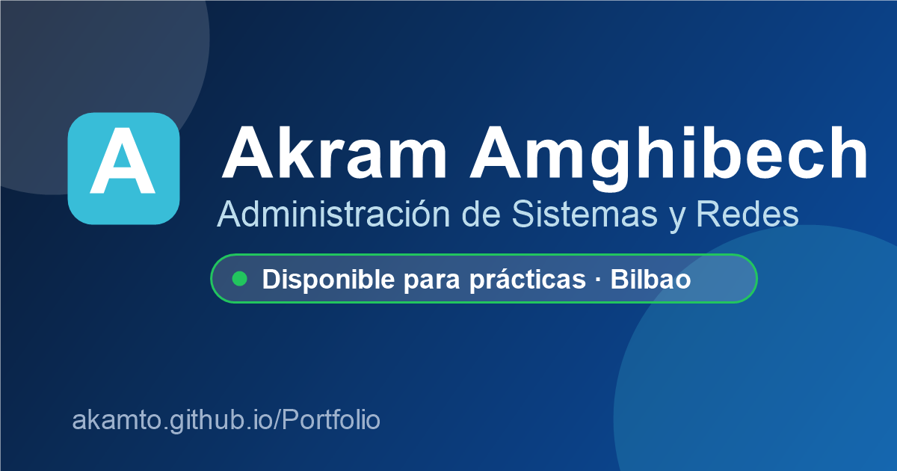

# Portfolio

Mi portfolio personal, técnico SMR en Bilbao.
Administración de sistemas Windows y Linux, redes Cisco. Busco prácticas en Bilbao y alrededores.

**Demo:** https://akamto.github.io/Portfolio/

## Contacto

- Email: akram.amghibech@ikasle.eus
- LinkedIn: https://www.linkedin.com/in/akamto/
- GitHub: https://github.com/akamto

## Licencia

MIT — ver [LICENSE](LICENSE).
